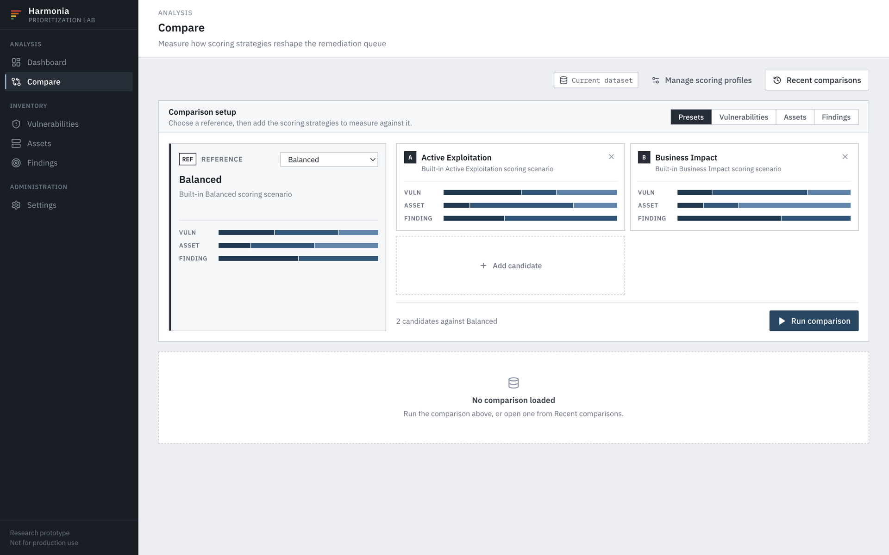
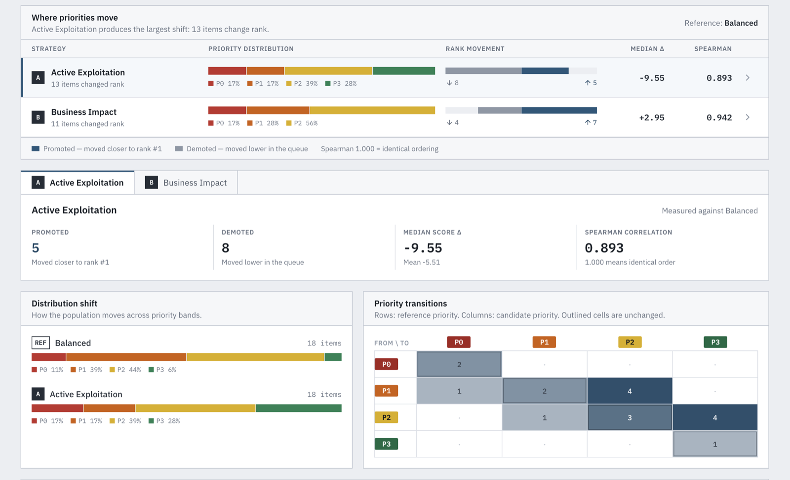

# Harmonia Lab demo

Use the synthetic stack from the [README](../README.md). The seed script refuses a database that already contains assets or vulnerabilities, and requires the dedicated `vvln_demo` database. PostgreSQL storage is disposable: stopping the DB container may lose the data. Do not import data you want to keep.

## Presentation walkthrough (5 minutes)

1. **Dashboard**: show the three stages. A vulnerability's score depends on CVSS/EPSS/KEV signals; an asset's score depends on exposure, criticality and patch complexity; findings combine both.
2. **Compare → Recent comparisons**: open the prepared comparison, or compose a new preset comparison with **Balanced** as baseline and **Active Exploitation** / **Business Impact** as candidates. Launch it and wait for `completed`.
3. **Results**: compare the distributions, then select a candidate. The matrix shows level changes; divergences show score and rank changes. A rank promotion does not necessarily imply a level change.
4. **Interpretation**: explain a divergence from the weights and the context. Active Exploitation puts more emphasis on exploitation signals; Business Impact on business context. Neither profile is ground truth.
5. **Assets**: show a Tomcat component and its Product decision, which is separate from the CVE match. **Vulnerabilities** shows the `SYNTHETIC DEMO` labeling of the data.

The `check_demo.py` command actually runs Product resolution → matching → a comparison job over the three presets → reading summaries and details, over HTTP. It computes all three scoring stages. It checks 18 findings and 18 rows per candidate; it does not simulate results on the UI side.

## Reference results for fixture v1

Run of 2026-09-27: 6 made-up vulnerabilities × 3 assets, all running Tomcat 9.0.80. All six synthetic constraints accept this version. Three components resolved, 18 findings.

| Preset | P0 | P1 | P2 | P3 | Spearman vs Balanced |
|---|---:|---:|---:|---:|---:|
| Balanced | 2 | 7 | 8 | 1 | — |
| Active Exploitation | 3 | 3 | 7 | 5 | 0.893 |
| Business Impact | 3 | 5 | 10 | 0 | 0.942 |

These differences illustrate how sensitive the ranking is to its assumptions. They measure neither real-world matching accuracy, nor risk reduction, nor the superiority of one profile. The fixture is deliberately small and makes no calls to real sources; ingestion tests separately cover normalizers and runners with mocked responses.

## Limitations to explain

Run configurations are snapshotted, but not the whole dataset. A recomputation can make the details of an older comparison unavailable. A reimport replaces components and can delete their findings/scores. Matching flattens some NVD configurations and does not produce a ternary status. See [evaluation](EVALUATION.md) and [resolution](RESOLUTION.md).

## Real screenshots

Captured on 2026-09-27 from the isolated demo stack (synthetic fixture, no private data).

